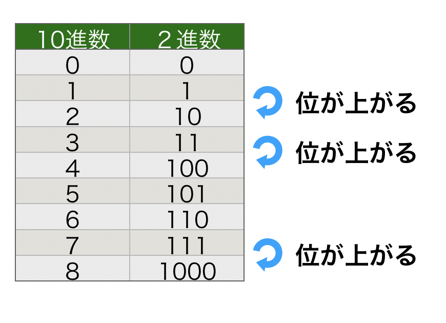
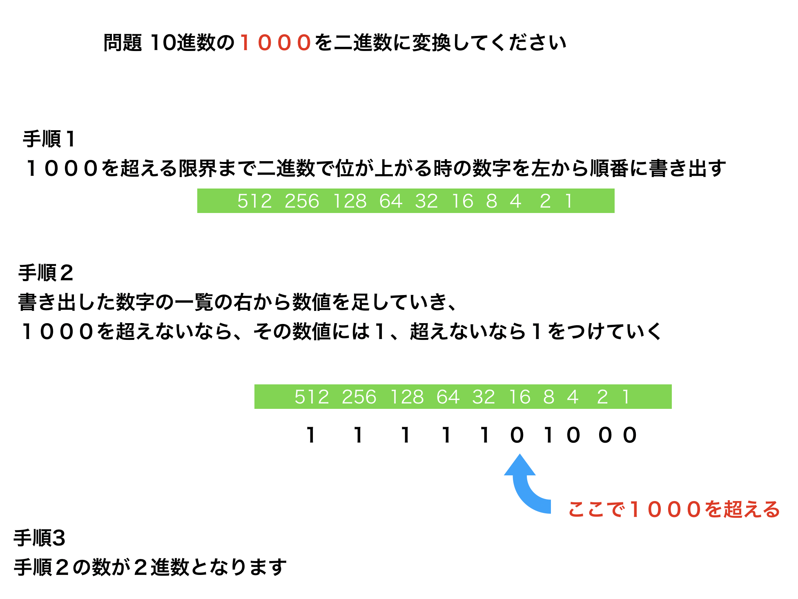
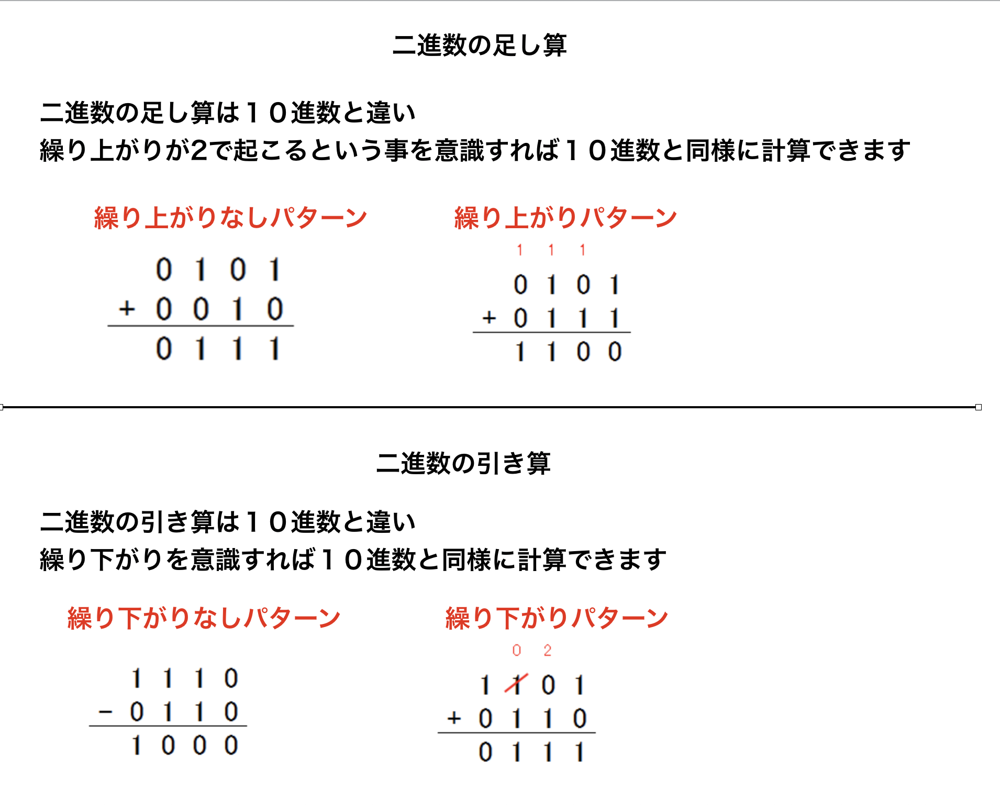
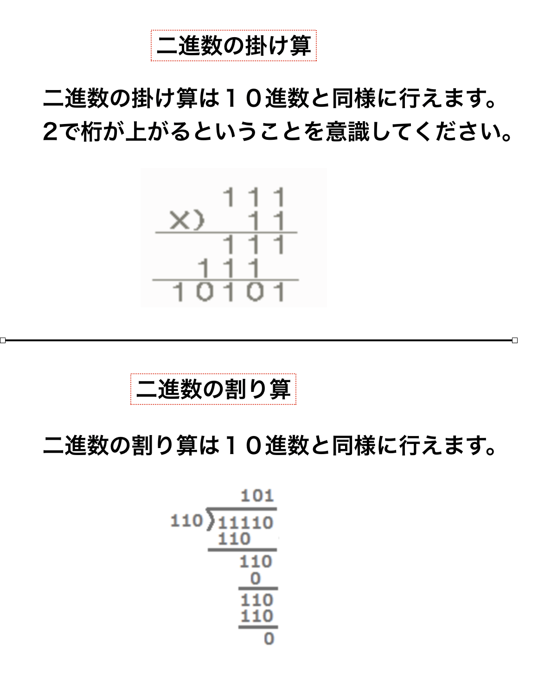

# ２進数(binary)を使えるようになる
普段私たちが使う数字は0から９まで存在しますが、
コンピュータの世界では0と１しか存在しません。   
突き詰めると、コンピュータはスイッチ（回路）のオンとオフの切り替えで全ての処理を実現しているからです。

私たちが普段使う数字は  
ちょうど１０で位が一つ上がるから１０で進む数で10進数と呼ばれています。  

つまり、コンピュータは０と１しか存在しないので２で位が上がることになり、二進数を使用します。

この資料では以下の事ができるようになることが目標です。
* １０進数を２進数で表現できる
* 2進数の足し算引き算ができる
* 2進数の掛け算、割り算ができる

## ２進数を使うことがあるのか
コンピュータが２進数を使うことは理解していただけたと思いますが、 
私たちは実際にコンピュータを使う時に２進数を使うことはほぼありません。  
例えばエクセルで3×3を計算する時に、11×11などという二進数の計算はしません。  
コンピュータが勝手に１０進数を変換して、二進数の計算を行ってくれるからです。

では２進数を覚える意味はないのかというと、そうではないと思います。  

サーバの権限を決めるためのパラメータやメモリの単位など
根幹の部分で２進数を使わなければならないケースが多いからです。 

メモリは512Mや1024Mなどと言ったキリの悪い数値になって売られていると思いますが、これは２進数とものすごく関わりがあります。  
どう関わりがあるかはこの後の説明でも何となくわかると思いますが
詳しくは調べてみてください。

まとめると、もっと単金が高いプログラミングを使うときやインフラを触る時などは少しは使うことになるから、簡単には知っておこうってお話です。

## 10進数を２進数で表現する

ではいよいよ二進数を使っていきます。  
概念は２で位が上がるだけなので、
おそらく下の表を見れば大体理解できるのではないかと思います。  
１０進数と２進数の対応表です。 

詳しく見ていくとパターンがわかると思います。  
ただこれでは例えば10進数の２００を２進数で表現しろと言われた場合
一つ一つ数えていかなければなりません。  
日が暮れてしまいます。

### もっと簡単な方法

上の対応表を見てもらうと、
1 2 4 8 で位が上がっていくことがわかります。
つまり次に位が上がるのは16です。

この特性を利用すると、意外と１０００くらいまでの１０進数は簡単に変換できます。

以下の方法を紹介しますので、ぜひマスターしてください。
すごく簡単です。

## 二進数の足し算と引き算

ほぼ１０進数と同様の方法なので以下の方法を参考にしてください。

## 二進数の掛け算と割り算

掛け算と割り算の方法は二通りあります。  
シフト演算という方法と普通に計算する方法です。  
コンピュータの計算ではシフト演算を使っていますが、今回は省略して人間が計算しやすい方法を紹介します。
ぜひシフト演算も調べてみてください。  

## コラム　なぜコンピュータのメモリなどは512Mなどの半端な数字なのか

PCを購入する時にメモリが512Mや1024Mなど半端な数字で提供されていることを見たことはないでしょうか  

この答えは二進数にあります。  
１０進数を使用する人間にとって、キリの良い数字というのは  
１０や１００などの桁上がりをする数字になります。  

二進数で考えると    
桁上がりする数字は2の2乗になります  
つまり 2 4 8 16 32 64 128 256 512 1024
がコンピュータにとってのキリの良い数値になります。

上の数値を見てみると、512や1024などメモリ使用されている数値が出てきますね。