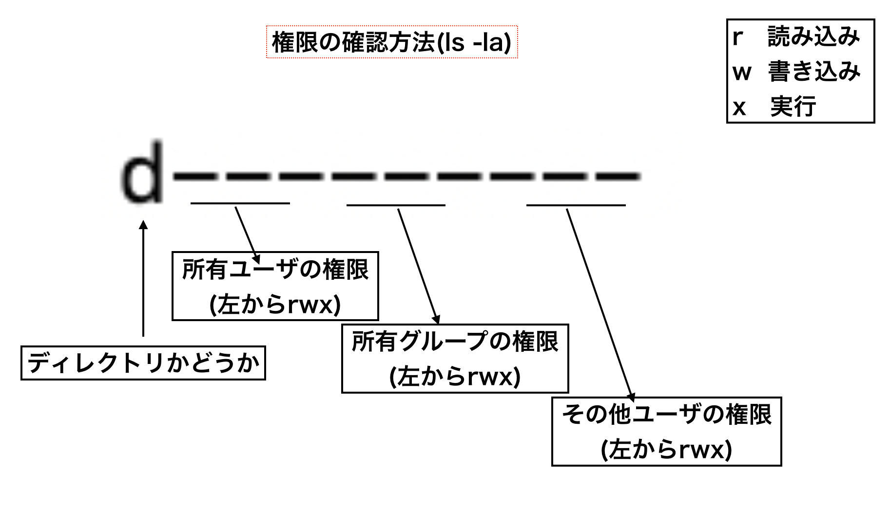

# パーミッション(権限)とは

サーバーのセキュリティを高めるためにパーミッションの知ることはとても重要です。

パーミッションとは<font color="DeepPink">ファイルを読みこみ・書き込み・実行を制限するための設定</font>になります。

例えば ``` ruby test.rb ``` というコマンドを入力すると
test.rbで記述したrubyコマンドを実行できます。  
しかしパーミッションを学びtest.rbファイルに対して特定のユーザやグループにしか実行権限をつけないことで実行を制限することもできます。

今回できるようになることは以下の二つです。
* ファイルやディレクトリに所有ユーザと所有グループを設定できる
* ファイルやディレクトリに読み込み・書き込み・実行権限を設定できる

## ファイルやディレクトリに所有者と所有グループを決める(chown)
ファイルに所有者と所有グループをつけるためのコマンドをご紹介します。  
これを実行することで、ファイルやディレクトリがユーザやグループ単位で読み込み・書き込み・実行制限をすることができます。  

そのコマンドは<font color="DeepPink">chown</font>
コマンドです。

使い方は以下の通りです。

``` chown -R ユーザ:グループ ファイルのパス ```

例えば/home/yryuu/test.rbをwheelグループでも使えるようにするための設定は以下になります。

``` chown -R yryuu:wheel /home/yryuu/test.rb ```

こうすることにより、ファイルの所有者とグループが変更されます。  
lsコマンドで確認してみましょう

``` ls -la /home/yryuu/test.rb 
-rw-r--r-- 1 yryuu wheel 0  2月  3 22:32 /home/yryuu/test.rb
```

左が所有者で右がグループになりますが、しっかり権限が付与されていることが確認できます。

## 書き込み・読み込み・実行権限をつける(chmod)

前の章ではchownコマンドを使って所有ユーザとグループユーザをつけることを学びましたが、  
これだけでは細かく権限をつけることはできません。

所有グループに対しては実行権限をなくしたり、その他のユーザに関しては読み込み権限のみを有効にしたりといった指定がされていないからです。

ではそういった権限はどこを見ればわかるでしょう
/homeディレクトリをls -laコマンドでみてみましょう

``` 
ls -a /home 

drwx------   4 yryuu         wheel      150  2月  3 22:32 yryuu
```

上記のような設定が表示されると思います。  
読み込み・書き込み・実行の権限は<font color="DeepPink">drwx------</font>の箇所になります。

権限の見方は以下の資料を参考にしてください


これらの権限は<font color="DeepPink">chmod</font>コマンドで指定できます。

chmodの使い方は以下の通りです。
```
chmod -R 777 ファイルのパス
```

上記はサンプルです。  
777の部分は可変でパーミッションの内容によって変わります。
ではどうやって数字を決めるでしょうか。  
ここで二進数を使います。  

7は二進数にすると111になります。(わからない人は[こちら](binary-number.md)を確認)

つまり777はばらすと111 111 111となります。  
先ほど権限の確認方法の資料をみていただきましたが  
権限は<font color="DeepPink">左からrwx（読み込み・書き込み・実行）</font>と指定できるので
<font color="DeepPink">777は所有ユーザ・所有グループ・その他ユーザ全てにrwx全ての権限を許可する</font>といった形になります。  

例えば所有ユーザ・所有グループには全ての権限を許可して、その他ユーザには読み込みしかさせたくない場合
111 111 100となるので、774を指定できます。

このコマンドは使うディレクトリやファイルによっては、重大な背キュリティ事故になるケースもあるので
何回も練習して指定したい権限をつけられるようにしましょう


## 課題

/homeに存在するディレクトリはそれぞれのユーザしかcdで移動できない設定になっています。

自分の/homeディレクトリの権限を確認し  
その他ユーザでもcdコマンドで移動してこられるように権限をつけてみましょう

ヒント  
cdコマンドでディレクトリに移動させるようにするためには  
読み込み・書き込み・実行権限の中で実行権限が必要になります。