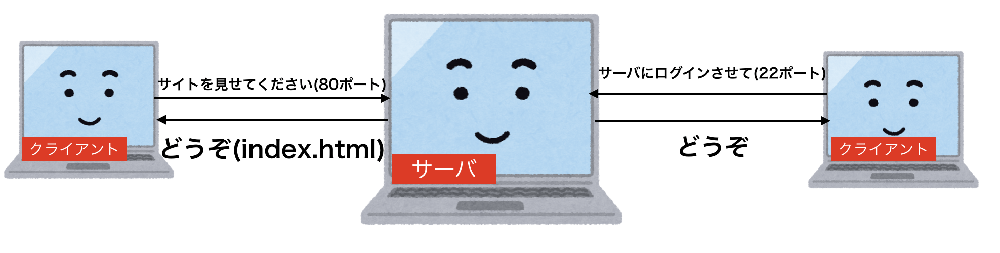

# WEBサーバ構築方法の学習

この資料ではWEBサーバ構築のための方法を記載する  

# 使用するサーバ
使用するサーバは以下になります。  
ポピュラーなOSで実際の現場でも多く使用されているCentOS7を使用します  

```
さくら VPS 1Gプラン
HDD 100G
カスタムOS CentOS7 x86_64
```

# 使用するモジュール
今回は以下のモジュールを使用して開発を行います  

| モジュール名 | 用途 |
| :---- | :---- |
|Apache2.4|コンテンツ(htmlなど)をサーバからブラウザに返す|
|Ruby(rails)|コンテンツを作成する|
|postfix|メールを送信する|
|mysql|DBを使用するため|

# 学習工程

この資料を通して以下の事が出来るようになる事が第一目的です。  
全てWEBサーバを構築するために最低限必要な項目になります。  

|項目|詳細|
|:--|:--|
|sshログイン|構築をするためにはまずサーバに入レなければなりません|
|ユーザの作成|root権限(神)を持つユーザを作成して、全てのセットアップができるようにします|
|viコマンドの理解|サーバのファイルをviコマンドを使って編集しますので最低限の知識|
|セキュリティの設定| デフォルトの設定のままだとサーバが乗っ取られてしまいますので対策をします|
|Apacheの設定|Apacheと呼ばれるWEBサーバ本体のセットアップをします|
|Mysqlの設定|Mysqlと呼ばれるDBツールを使用し、DBを使えるようにします。また外部からDBへ接続できるようにするための設定なども行います|
|railsの設定|defaultのrailsテンプレートを動かせるようにします|
|postfixの設定|メールの送信のためにpostfixと呼ばれるモジュールの設定を行います|

## コラム1　ポートとは

サーバにはポート(port)というものがあります。  

簡単に説明するとポートとはサーバについている穴です。  
サーバにはポート（穴）がたくさん存在します。  

サーバはどの穴を通ってきたリクエストなのかを判定して特定の処理を送ります。  

例えばブラウザでサイトにアクセスするときに  
ブラウザ側(クライアント側)では80portや336portという決まったポートに対してアクセスします。  
これによってサーバ側では80portにアクセスが来たからhtmlを返せば良いのだと判断します。  
ブラウザが間違って90portなどでアクセスしてしまうとサーバ側では何のアクセスなのかが分からずに、リクエストを処理できません。  

代表的なポートを以下に記載しておきます。  
そこまで詳しく覚えておく必要はありません。  

|port|用途|
|:----|:----|
|22 | ssh接続に使用されることが多い。バレると危ないので変更するケースが多い|
|80| http接続に使う|
|443|https接続に使う|
|3306|mysqlへの接続に使う|

イメージ画像  


## 資料一覧
* [sshログインとユーザ作成](curriculum/user-create.md)

* [二進数の理解]()